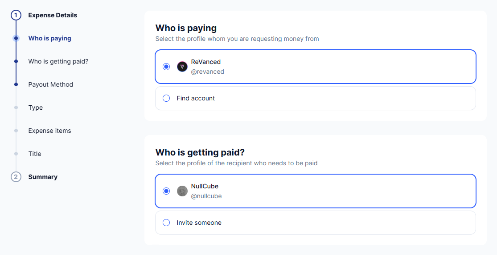
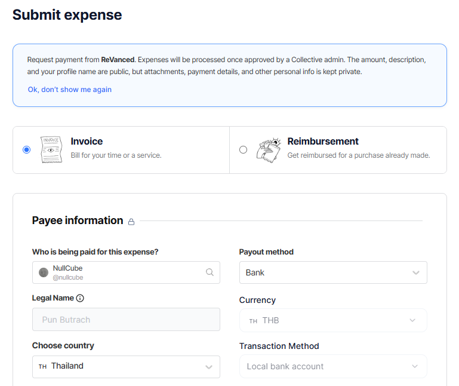

# 🏦 ReVanced Invoicing System

> **WARNING**
> You must have an `@revanced.app` email address to use the invoicing system.
> Please contact team if you haven't gotten access to the email yet.

To generate an invoice to ReVanced, go to https://invoicing.revanced.app/

You'll be met with CloudFlare Zero Trust login page, enter your organisation email and 
the OTP code will be sent to your email.

## 🧑‍🏭 Generating invoices

> **DANGER**
> If you don't have identification, toggle tax obligation off.
>
> **You are under the penalty of perjury if it's found out you actually have an government-issued identification.**

> **CAUTION**
> If you need the middle-man, be prepared to present identifications such as
> government-issued National ID card, passport, or any if requested by admin.

### Replacing the legal reference

> **DANGER**
> **This guide DOES NOT offer you free legal advises** nor liable for any damages.

To replace the legal reference in your invoice, scroll down to the amendment section,
toggle the acknowledgment check then proceed to enter your own legal statement.

Typically with your own law on 
***how will you be managing this income with the your country's tax agency, if you don't know consult with your tax advisor.***

### Generating invoices

1. Fill out your actual home address into form
2. Fill out your Tax ID (this usually refered to government-issued Tax ID or National ID, **please check with your country tax code** or else tick not eligble)
3. Select the services you provided, you can choose multiple services if applicable.
4. IF you are acting as a middle-man for someone else, follow these steps:
    1. In the "Payment Aggregation and Distribution" section, increase the number by 1 for each person you are representing. (0 = no middle-man)
    2. The total payout will increase as a multiple of your own payout and the amount of people you are middle-manning for. For instance, if your designated payout amount is 30€, and you're middle-manning for three people, your total payout will be increased by 30€ * 3, resulting in an additional 90€ added to your payout.
    3. Make sure that the person you're middle-maning to **had** the required identifications (e.g., National ID) as this will be in use later when requested by Open Collective administrators.
5. Enter your own payout amount, **make sure to be in sync with the rest of the team as all team members get equal amount.**
6. Submit the invoice then a PDF file will be downloaded.

## 🧾 Submitting invoices

### Open Collective

> **WARNING**
> You must have an configured **Open Collective** account to submit the invoice.
> Please register or configure your account if you haven't, or let someone be the middle-man for you.

> **CAUTION**
> If you need the middle-man, be prepared to present identifications such as
> government-issued National ID card, passport, or any if requested by admin.

#### Invoicing page

##### New invoicing submission page

To submit an invoice to ReVanced's Open Collective, go to ReVanced's collective page and
submit expense, from there choose **Invoice**, say that you have an invoice, 
upload the PDF file that were generated by invoice system, and input the reference number. 
(the number is displayed on the PDF file)

After that set the expense item description to `Voluntary IT Work (Team Split), {Month} {Year}`, set the date to current date for the expense submission then fill out the total amount from your generated invoice.

> **TIP**
> Set the item currency to €EUR for easy currency conversion.

> **NOTE**
> Additional Attachment is not needed.

Set the title to *Payout split*, *Team member payout, {Year}*, or whatever the team decided on, and add the `payout` tag.

Wait for further approvals from ReVanced fund administrators, and Open Collective *Europe* administrators.

##### Old invoicing submission page

To submit an invoice to ReVanced's Open Collective, go to ReVanced's collective page and
submit expense, from there choose **Invoice**, select your payout method, set the expense title to *Payout split*, *Team member payout, {Year}*, or whatever the team decided on, and add the `payout` tag, upload the PDF file that were generated by invoice system, and input the reference number.
(the number is displayed on the PDF file)

> **NOTE**
> Additional Attachment is not needed.

After that set the expense item description to `Voluntary IT Work (Team Split), {Month} {Year}`, set the date to current date for the expense submission then fill out the total amount from your generated invoice.

> **TIP**
> Set the item currency to €EUR for easy currency conversion.

Wait for further approvals from ReVanced fund administrators, and Open Collective *Europe* administrators.

#### Making amendment to invoices

In any case should ReVanced or the Open Collective *Europe* administrators need you to amend your invoice, follow the step to #Generating-invoices again, after you have done making adjustment, generate it, then edit your invoice to replace the problematic invoice, and update the expense date to current date from your generated invoice.

#### Making amendment to ***already payed out*** invoices

In any case should the Open Collective *Europe* administrators need you to amend your already payed invoice, follow the step to #Generating-invoices again, after you have done making adjustment, edit the generated date to your invoice.

1. Change the *creation* & *due date* from amendment section to when your originally issued invoice.

Generate it, then submit it to whenever Open Collective Europe want you to, usually to oce@opencollective.com
